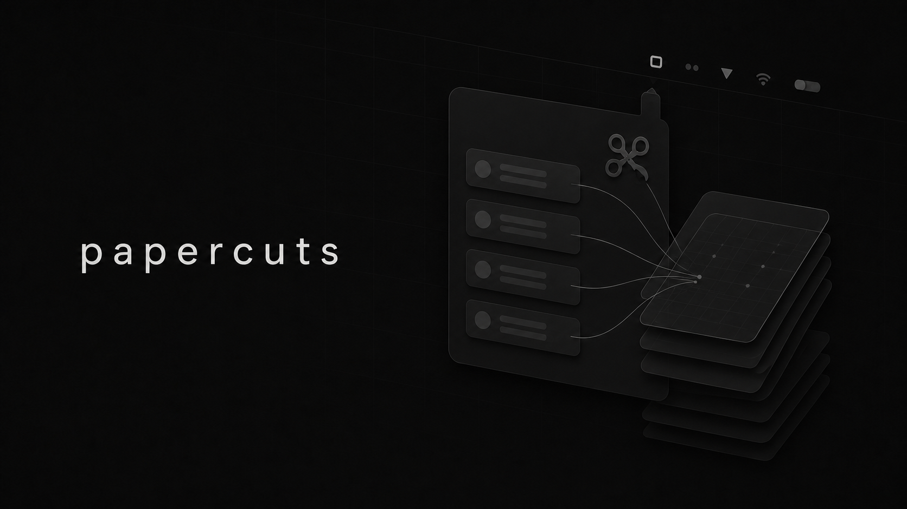

# Papercuts



A local macOS menubar utility for recording small issues discovered by coding agents.

## Build

```sh
swift test
swift build -c release
scripts/build-app.sh
scripts/run-app.sh
```

Run the CLI from a Git repository:

```sh
.build/release/papercut add \
  --title "Example papercut" \
  --description "The useful detail" \
  --why "It slows down future work" \
  --prompt "Inspect the issue and implement the smallest robust fix."
```

The menubar app reads the same local store and automatically captures the current repository and branch.
